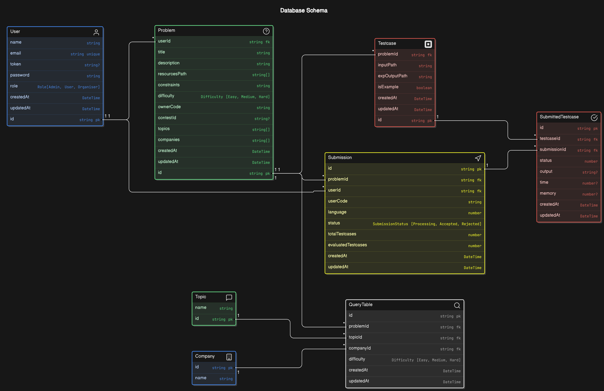
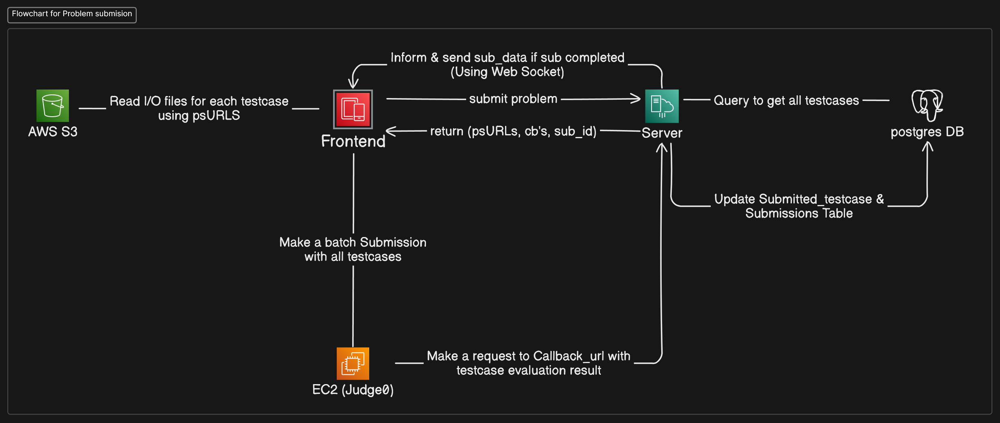

# CompeteNest: An Online Code Judge Platform

An online code judge platform allowing users to write, run, and test code in multiple languages. The platform evaluates user submissions against predefined test cases and is designed to support coding contests in the future.

## Project Description

This platform provides a competitive programming environment where users can submit code, which is then evaluated for correctness and efficiency. The platform is hosted on **AWS** infrastructure, with **Judge0** running on an **AWS EC2** instance to handle code execution, **AWS S3** for storing input/output test case files, and **PostgreSQL** for managing user and submission data. The frontend is built with **React** and **TypeScript**, using **Monaco Editor** to offer a rich coding experience.

## Features

- **Code Editor**: Integrated **Monaco Editor** for syntax highlighting, autocompletion, and error detection.
- **Code Execution and Evaluation**: Powered by **Judge0** hosted on an EC2 instance.
- **File Storage**: Uses **AWS S3** for test case files.
- **Database**: **PostgreSQL** for storing users and submission data.
- **Future Feature**: Coding contests with live scoring and leaderboards.

## Tech Stack

- **Frontend**: React, TypeScript, Monaco Editor, React-Toastify
- **Backend**: Node.js, Express, TypeScript
- **Execution Engine**: Judge0 hosted on AWS EC2
- **Storage**: AWS S3
- **Database**: PostgreSQL

## Completed Tasks

- Set up **Judge0** on **AWS EC2** for code execution.
- Configured **AWS S3** for storing test case files.
- Integrated **PostgreSQL** as the primary database.
- Built the code editor interface using **Monaco Editor**.
- Implemented basic UI for code submission and result display with **React** and **React-Toastify**.

## Database Schema

[//]: # (> This section should describe the structure of the database, including tables and their relationships. Update the image and add specific details about tables, columns, data types, and constraints.)

## Submission Flowchart

[//]: # (> This section explains the code submission process. Add details on each step of the flow, including how user code is processed, evaluated, and how results are returned to the user.)

## To-Do

- Implement user authentication and authorization.
- Add a dashboard for users to view submission history.
- Integrate a coding contest feature.
- Enhance the editor with additional languages and functionality.
